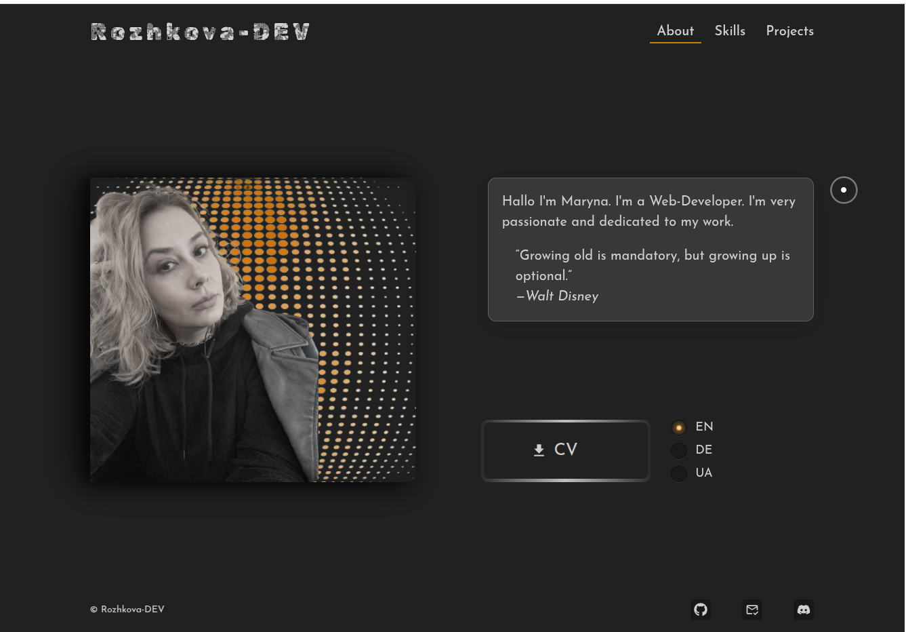
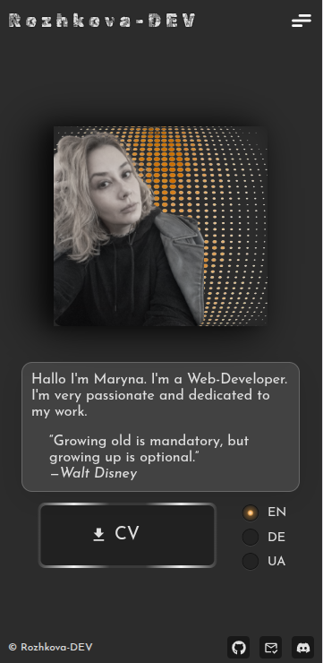

# 🌐 Maryna Rozhkova — Web Developer Portfolio

This is my **personal portfolio website**, built to showcase my development projects, design skills, and academic background. The goal: minimalism, clarity, and a mobile-first experience with personality.

🔗 **Live demo**: [https://marrozhkova-portfolio.vercel.app/](https://marrozhkova-portfolio.vercel.app/)

---

## 💡 Features

- 📱 **Responsive Design** — mobile-first, 468px optimized
- 🧑‍💻 **About Me**, **Projects**, and **Contact** sections
- 🖼️ Highlighted works with links to live demos and GitHub repos
- 🎨 Clean UI with soft animations and modern typography
- 🌙 Dark theme visual styling

---

## 🎯 Purpose
This project represents my skills, style, and values as a developer. It also serves as a sandbox to experiment with layout patterns and visual storytelling. It's an evolving space — I update it as my journey continues.

---

## 🧑‍💻 Tech Stack

- **React** (Functional Components)
- **CSS Modules** (component-scoped styles)
- **Vite** (lightweight bundler)
- **Deployed via Vercel**

---

## 📸 Screenshots

| Desktop View | Mobile View |
|--------------|-------------|
|  |  |


---

## 🛠️ Local Setup

```bash
git clone https://github.com/marrozhkova/portfolio.git
cd portfolio
npm install
npm run dev
```
---

## 👤 Author

**Maryna Rozhkova**  
Frontend Developer | Learner by Heart  
📫 [mar.rozhkova@gmail.com](mailto:mar.rozhkova@gmail.com)  
🌐 [Portfolio](https://marrozhkova-portfolio.vercel.app/)
